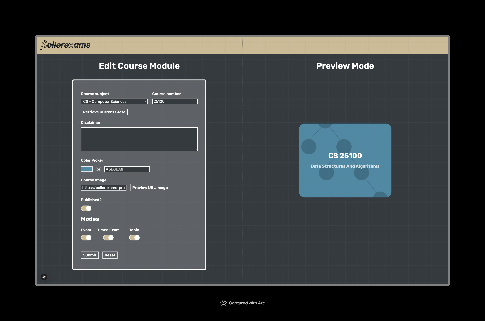

# Course Form - Boilerexams

Hey, if you're viewing this and not from the Boilerexams team, this was something I developed as a part of my interview process to join the team as a front-end engineer. wish me luck? 🤞

I built a course form, that I'm assuming a website admin might use, to update settings related to how each course might show up on the website. If you're not aware, [Boilerexams](https://boilerexams.com) is a platform with a bunch of mcqs and stuff for Purdue students to prepare for their exams.

The platform cooperates with professors to gain access to past exams and other material to provide additional material for students to prepare. It's a pretty cool website, with at the moment, over 271,000 hours spent studying on the platform. Anyway here's a screenshot of the small lil thing I built. Very simple, not much going on.

You can run it by simply cloning, running `pnpm install` followed by `pnpm dev`. Built primarily with Next, Typescript & Tailwind.

 

 
 
&nbsp;&nbsp; 1 commit build? - akshithio - 2024

